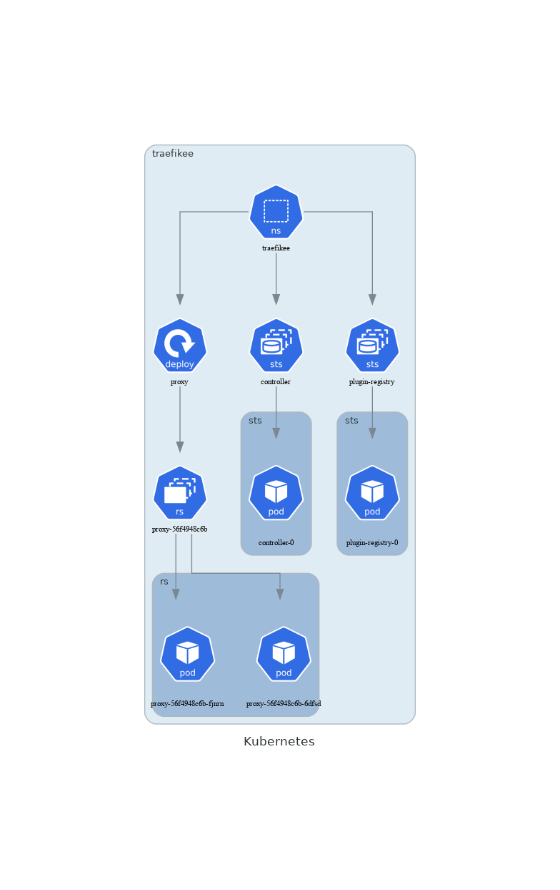

# Kubernetes diagrams
k8s-diagrams creates diagrams from your kubernetes clusters. You just have to provide a namespace (or not), and it creates a png of your cluster.

## How do I build it?
```sh
$ make build
```

## Usage
```sh
$ ./k8s-diagrams --help                                                                                           ✔ 
NAME:
   k8s-diagrams - Create diagram from the Kubernetes API.

USAGE:
   k8s-diagrams [global options] command [command options] [arguments...]

COMMANDS:
   help, h  Shows a list of commands or help for one command

GLOBAL OPTIONS:
   --namespace value, -n value        The namespace we want to draw. (default: "default") [$KUBECTL_NAMESPACE]
   --kubeconfig value, -c value       The path to your kube config file. [$KUBECONFIG]
   --outputFilename value, -o value   The output filename. (default: "k8s")
   --outputDirectory value, -d value  The output directory. (default: "diagrams")
   --label value, -l value            The diagram label. (default: "Kubernetes")
   --help, -h                         show help (default: false)
```

## Usage example
```sh
$ ./k8s-diagrams -n mynamespace -d diagrams -o k8s
$ cd diagrams
$ dot -Tpng k8s.dot > k8s.png
```

## Render example
